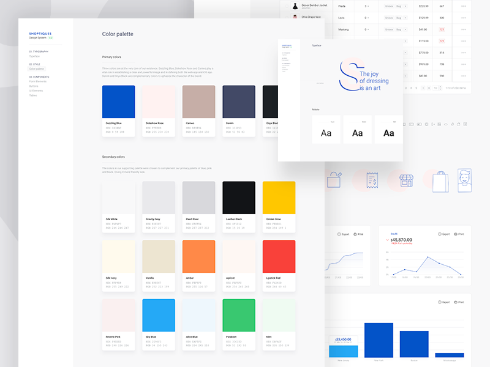
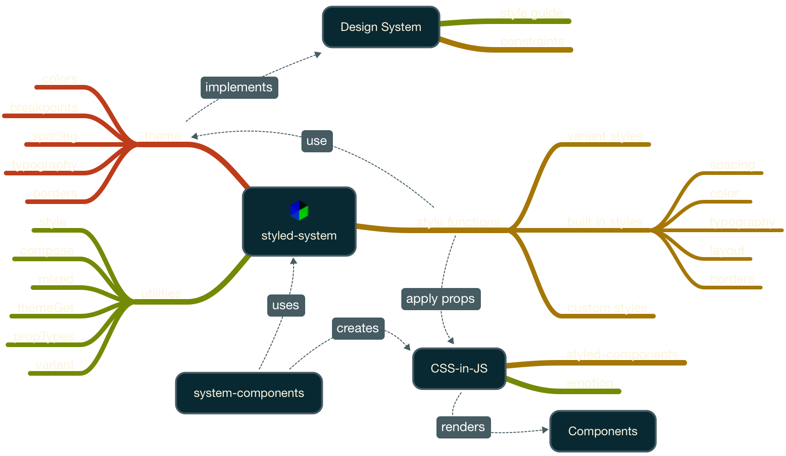

import { Appear, Head, Image } from 'mdx-deck'
import { Flex, Box } from 'grid-styled'
import {
  Center,
  Leading,
  Invert,
  Split,
  SplitRight
} from './src/layouts'
import {
  CodePlayground,
  CodeSandbox,
  CodeSlide,
  Emoji,
  Inline,
  ListItem,
  Paragraph,
  UnorderedList,
  UnstyledList,
  StackBlitz
} from './src/components'

<!-- <StackBlitz width="60vw" id="styled-system-workshop-exercise-solution" /> -->
<!-- <CodeSandbox id="woy5w424zl" /> -->

export theme from './src/theme'

<Head>
  <title>Programming Design Systems with Styled System</title>
  <link rel="icon" type="image/svg+xml" href="images/styled-system.svg" />
</Head>

export default Center

# <small>Programming</small> Design Systems <small>with</small> <br/>`styled-system`


---

# Learning Outcomes

- Design systems overview
- Overview of `styled-system` API
- Building a design system with `styled-system`

---

# Design Systems

- Visual design language
- Set of design rules and constraints
- Resilient to change (rebranding)

---

export default Invert

[Design Language Image]

---

## Why?

- Unite product teams around a common visual language
- Streamline the design process
- Maintain design consistency
- Accelerate innovation through reuse

---

export default SplitRight



## May Consist Of

- Style Guide & UX Patterns
- Tools (Sketch, Figma, Illustrator, etc)
- Processes & Workflows
- CSS Library
- Component Library
- ...

---

export default Invert

<Image src="images/airbnb-dls.png" />

---

## Design System Constraints <small>aka Variables or Tokens</small>

<UnorderedList>
  <ListItem listStyleType="'🎨'">Colours</ListItem>
  <ListItem listStyleType="'↔️'">Spacing - Padding & Margin</ListItem>
  <ListItem listStyleType="'📏'">Sizing - Width & Height</ListItem>
  <ListItem listStyleType="'𝓕'">Typography - Type Scale, Weight, & Line Height</ListItem>
  <ListItem listStyleType="'➕'">etc ...</ListItem>
</UnorderedList>

---

## CSS Class Names Based Design System

```css
/* BEM */
.Card {/* */}
.Card__Header {/* */}
.Card__Body {/* */}
.Card__Action--primary {/* */}
.Card__Action--secondary {/* */}
```

```html
<div class="Card">
  <h2 class="Card__Header">Hello</h2>
  <div class="Card__Body">Lorem ipsum dolor sit amet</div>
  <div>
    <button class="Card__Action--primary">Yes</button>
    <button class="Card__Action--secondary">No</button>
  </div>
</div>
```

---

<UnorderedList>
  <ListItem listStyleType="'‍🤷🏽'">Have to write CSS to prototype new UI</ListItem>
  <ListItem listStyleType="'🔁'">Have to keep two abstractions in sync (HTML & CSS)</ListItem>
  <ListItem listStyleType="'😰'">"If I modify this class will it break something else?"</ListItem>
</UnorderedList>

---

> You have access to a more powerful styling construct than CSS class names. You have components!
> <cite>Michael Chan, <a href="https://medium.com/learnreact/scale-fud-and-style-components-c0ce87ec9772#.kg9vgnw39">“Scale” FUD and Style Components — learnreact</a></cite>

---

export default Leading

You are the design system author. Your users are other developers.

Don't make your users write CSS. Let them compose components.

---

## Component Based Design System

---

export default Center


---

export default Center


---

export default Center


---

## Component Based Architecture + Design System

<Flex>
  <Box width={1/2}>
    <h3>Primitive Components</h3>
    <UnorderedList>
      <ListItem>Lowest-level building block</ListItem>
      <ListItem>Encapsulate styles and contain no logic</ListItem>
    </UnorderedList>
  </Box>
  <Box width={1/2}>
    <h3>Macro Components</h3>
    <UnorderedList>
      <ListItem>Composition of system-components</ListItem>
      <ListItem>May contain some UI logic</ListItem>
      <ListItem>Contain no application logic</ListItem>
    </UnorderedList>
  </Box>
</Flex>

---

export default Center


---

<UnorderedList>
  <ListItem listStyleType="'‍🙌'">Removes the mapping between components and CSS class names</ListItem>
  <ListItem listStyleType="'📦'">Components as a low-level styling construct</ListItem>
  <ListItem listStyleType="'🤝'">Designers can create a shared language with developers</ListItem>
</UnorderedList>

---

## Component Based Design Systems

<Flex>
  <Box width={1/2}>
    <UnorderedList>
      <ListItem>Salesforce Lightning</ListItem>
      <ListItem>IBM Carbon</ListItem>
      <ListItem>Google Material</ListItem>
      <ListItem>Shopify Polaris</ListItem>
    </UnorderedList>
  </Box>
  <Box width={1/2}>
    <UnorderedList>
      <ListItem>Audi UI</ListItem>
      <ListItem>Microsoft Fluent</ListItem>
      <ListItem>Priceline One</ListItem>
      <ListItem>Rebass</ListItem>
    </UnorderedList>
  </Box>
</Flex>

---

# Styled System

- Design system utilities for CSS-in-JS
- Component based abstraction
- Created by Brent Jackson [@Jxnblk](https://twitter.com/jxnblk) (Basscss, Grid Styled)

---



---

- Applies style functions to CSS-in-JS components
- Style functions access design system contraints
- Applies customization props to components
- Works with most CSS-in-JS libraries

---

import styled, { css } from 'styled-components'

## Styled Components <small>[API](https://www.styled-components.com/docs/basics#getting-started)</small>

<CodePlayground
  code={require("!raw-loader!./code-samples/styled-components-box.js")}
  height="60vh"
  previewBackground="linear-gradient(-180deg, #2382AE 0%, #C86DD7 100%)"
  previewFlex={1}
  editorFlex={1.5}
  scope={{ styled, css }}
/>

---

import { space, width, fontSize, color, flex, alignSelf } from 'styled-system'

## Styled System <small>[API](https://jxnblk.com/styled-system/getting-started)</small>

<CodePlayground
  code={require("!raw-loader!./code-samples/styled-system-box.js")}
  height="60vh"
  previewBackground="linear-gradient(-180deg, #2382AE 0%, #C86DD7 100%)"
  previewFlex={1}
  editorFlex={1.5}
  scope={{ styled, space, width, fontSize, color, flex, alignSelf }}
/>

---

## System Components

1. Set defaults with `clean-tag`, `clean-element`
1. Apply `styled-system` style functions
1. Render with CSS-in-JS library (`styled-components`)

---

import system from 'system-components'

## System Components <small>[API](https://jxnblk.com/styled-system/system-components)</small>

<CodePlayground
  code={require("!raw-loader!./code-samples/system-components-box.js")}
  height="60vh"
  previewBackground="linear-gradient(-180deg, #2382AE 0%, #C86DD7 100%)"
  previewFlex={1}
  editorFlex={1.5}
  scope={{ system }}
/>

---

- Supports custom CSS styles (e.g. `&:hover`)
- Can use underlying CSS-in-JS API (e.g. dynamic props, `css`)

---

export default Leading

<Paragraph><Inline color="blue">system-components</Inline> simpler authoring experience when using styled-system</Paragraph>
<Paragraph><Inline color="green">styled-system</Inline> design system utilities to build design system components</Paragraph>
<Paragraph><Inline color="pink">styled-components</Inline> CSS-in-JS library</Paragraph>

---

## Styled System Ecosystem


---

<CodePlayground
  code={require("!raw-loader!./code-samples/system-components-typography.js")}
  previewBackground="#fff"
  previewAlign="left"
  previewFlex={1}
  editorFlex={1.5}
  scope={{ system }}
/>

---

export default Leading

What Even Is A Component?

Everything!<br/>Start as small as a single HTML tag

---

## Component Best Practices

- Small Components
- Compose Variations
- Compose Complexity
- Use <Inline color="blue">{children}</Inline>, <Inline color="green">slots</Inline> or <Inline color="gold">projection</Inline>
- Avoid recreating the platform

---

## Core Components

- Box (general purpose layout component)
- Text & Heading
- Card & Panel
- Image & Avatar (circle image)
- Button & Link
- Input, TextArea & Label

---

export default Leading

[rebass/components](http://jxnblk.com/rebass/components) is a great example of the type of components you should build & good APIs for design system components.

---

## Theme <small>[API](https://jxnblk.com/styled-system/table)</small>


---

<CodeSlide
  code={require("!raw-loader!./code-samples/styled-system-theme.js")}
  title="Theme"
  showNumbers={true}
  dark={false}
  steps={[
    { range: [0, 1], title: 'theme.js', notes: `` },
    { range: [3, 3], title: 'Breakpoints', notes: ``
    },
    { range: [4, 4], title: 'Space', notes: `
        → Used for margin and padding scales
        → Recommended to use powers of two to ensure alignment when used in nested elements
        → Numbers are converted to px
      `
    },
    { range: [5, 22], title: 'Typographic Scales', notes: `` },
    { range: [23, 32], title: 'Border Styles', notes: `` },
    { range: [33, 35], title: 'Sizing', notes: `` },
    { range: [36, 60], title: 'Color', notes: `
        → Nested objects work as well
        → Arrays can be used for scales of colours
      `
    },
    { range: [105, 114], title: 'Apply the theme' }
  ]}
/>

---

- Style prop functions from `styled-system` attempt to resolve values from theme first
- Many style functions have defaults or fallback logic (e.g. system colour names)
- Values can be overriden based on context

---

## Style Props

`CSS-in-JS` -> Style as a function of state

```jsx
const style = (state) => ({
  color: state.primary ? 'blue' : 'darkgray'
})
```

- Creates props that map to CSS
- Most map to a single CSS property
- Can be composed for easy re-use

---


---

# Creating Components

- ✂️ Slice
- 🔖 Assign (system-component, an extension or custom)
- 👨🏽‍🏭 Compose

---

## Media Object

[TODO] - Show example of media object decomposed

---

## Exercise #1 - Primitive Components

[TODO] - Cover, Title, Description, Button

---

## Exercise #2 - Marco Components

[TODO] - Compose primitives into media object

---

# Layout Components

- `Flexbox` style functions
  - [`grid-styled`](https://jxnblk.com/grid-styled/)
- `CSS Grid` style functions

---

## Responsive Props

`width` | `fontSize` | `margin` | `padding`

```jsx
<Box
  width={[
    1,      // 100% below the smallest breakpoint
    1 / 2,  // 50% from the next breakpoint and up
    1 / 4,  // 25% from the next breakpoint and up
  ]}
/>
```

---

## Exercise #3 - Responsive Layout

[TODO] - Responsive Media Object

---

# Customization

- Use `style` to create custom style functions
- Use `compose` to combine style functions

---

## Examples

- `style`
- `compose`

---

## Exercise #4 - Button Group

- Button group with rounded corners on edges only
- Custom border corner specific style function
- Use `compose` to simplify adding each style function

---

## Dynamic Styles

- Use `(props) => ({ style }})` to customize
- Use `themeGet` to resolve theme values
- Use `mixed` to mix styled-system with CSS styles

---

## Exercise #5 - Dynamic Props

- Button toggle state for button group
- themeGet for `selected` theme color
- Apply mixed default style for buttons (hover)?

---

# Advanced

- `variant`
- `mixed` ??

---

## Variants

- Built in variants
- demo with primary & secondary buttons
- Other approaches to the concept of variants
- Custom variants

---

## Other Frameworks

- [Emotion](https://emotion.sh/) alternative `CSS-in-JS`
- [vue-styled-system](https://github.com/c8r/vue-styled-system) for `Vue.js`
- [Fela](http://fela.js.org/docs/guides/UsageWithAngular2.html) or [Emotion](https://stackblitz.com/edit/angular-emotion) for `Angular`

---

# Additional Resources

- [The Evolution of CSS & UI Architecture](https://www.notion.so/rangle/The-Evolution-of-CSS-UI-Architecture-2291e1c572d0458ea6eac47a3071f686)
- [Styled System](https://jxnblk.com/styled-system/)
- [Priceline Design System](https://github.com/pricelinelabs/design-system)
- [Rebass](https://jxnblk.com/rebass/)

---

# Thank You!

https://github.com/rangle/styled-system-workshop
