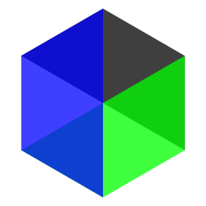
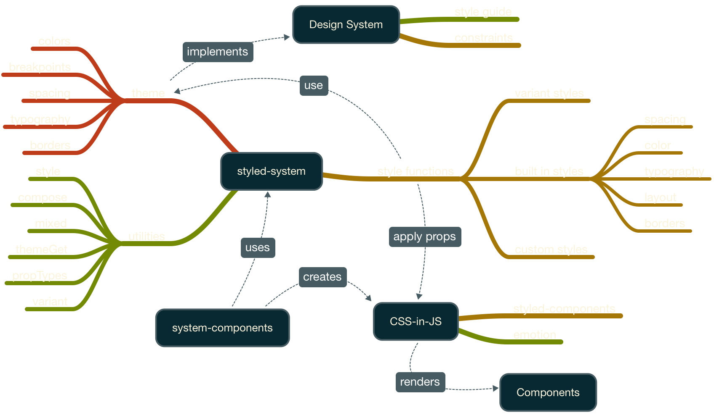
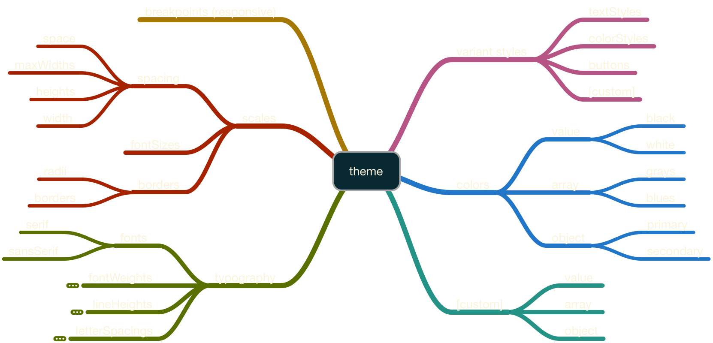
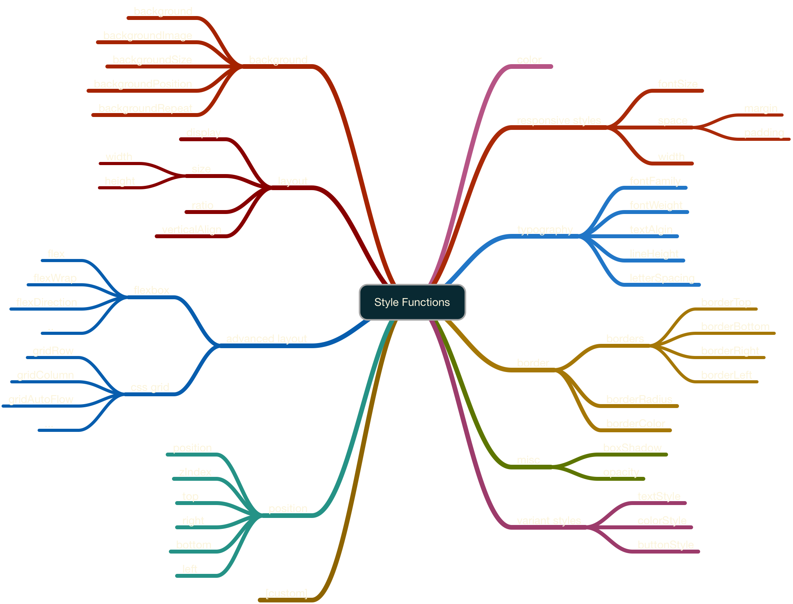
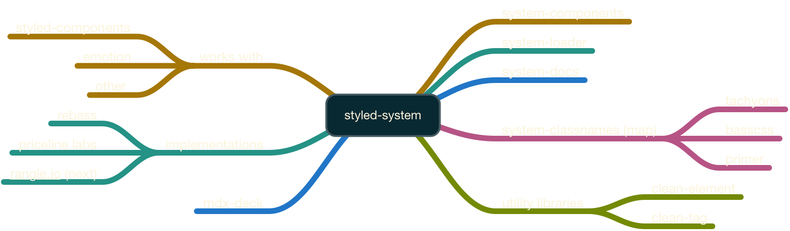

import { Appear, Head, Image } from 'mdx-deck'
import { Invert, Split, SplitRight } from 'mdx-deck/layouts'
import { Flex, Box } from 'grid-styled'
import { Emoji, ListItem, UnorderedList, UnstyledList, StackBlitz } from './components'

export theme from './theme'

<Head>
  <title>Programming Design Systems with Styled System</title>
</Head>

# <small>Programming</small> Design Systems <small>with</small> <br/>`styled-system`



---

## StackBlitz Usage

<StackBlitz width="60vw" id="react-jb5dw3" />

---

# Learning Outcomes

1. The What, Why & How of Design Systems?
1. Styled System Overview & API
1. Components with `styled-system` + `styled-components`
1. Components with `system-components`

---

# Why use a Design System?

- Unite product teams around a common visual language
- Accelerate design process by bridging teams
- Enforce the Design Language

---

export default Invert

<Image src="images/airbnb-dls.png" />

---

## Design Constraints <small>aka Design System Variables</small>

<UnorderedList>
  <ListItem listStyleType="'🎨'">Colours</ListItem>
  <ListItem listStyleType="'↔️'">Spacing - Padding & Margin</ListItem>
  <ListItem listStyleType="'📏'">Sizing - Width & Height</ListItem>
  <ListItem listStyleType="'𝓕'">Typography - Type Scale, Weight, & Line Height</ListItem>
  <ListItem listStyleType="'➕'">etc ...</ListItem>
</UnorderedList>

---

## [The Evolution of<br/>CSS & UI Architecture](https://www.notion.so/rangle/The-Evolution-of-CSS-UI-Architecture-2291e1c572d0458ea6eac47a3071f686)

---

# Styled System

- Design system utilities for CSS-in-JS
- Created by Brent Jackson [@Jxnblk](https://twitter.com/jxnblk) (Basscss, Grid Styled)

---



---

## What

- Applies style functions to CSS-in-JS components
- Style functions access design system contraints
- Applies customization props to components

---

## Theme

<Flex>
  <Box width={1/2}>
    <UnorderedList>
      <ListItem listStyleType="'🎨'">Colours</ListItem>
      <ListItem listStyleType="'️↔'">Space</ListItem>
      <ListItem listStyleType="'📏'">Size</ListItem>
      <ListItem listStyleType="'𝌮'">Breakpoints</ListItem>
    </UnorderedList>
  </Box>
  <Box width={1/2}>
    <UnorderedList>
      <ListItem listStyleType="'𝓕'">Typography</ListItem>
      <ListItem listStyleType="'⃞'">Borders</ListItem>
      <ListItem listStyleType="'➡️'">Variants</ListItem>
    </UnorderedList>
  </Box>
</Flex>

---

## Defining a Theme

```js
// theme.js
export default {
  colors: {
    black: '#000',
    white: '#fff',
    blue: '#07c',
    grays: ['lightgray', 'lightgray', 'gray', 'darkgray'],
    blues: ['lightblue', '#07c', 'navyblue', 'darkblue'],
    ...
  },
  space: [0, 4, 8, 16, 32, 64, 128, 256, 512],
  breakpoints: ['40em', '52em', '64em'],
  fontSizes: [16, 24, 32, 48, 64, 96, 128],
  ...
}
```

---

## Applying the Theme

```jsx
import React, { Component } from 'react'
import { ThemeProvider } from 'styled-components'
import theme from './theme'

export class App extends Component {
  render() {
    return (
      <ThemeProvider theme={theme}>
        <AppShell />
      </ThemeProvider>
    )
  }
}

export default App
```

---

## Using the Theme

- Props attempt to resolve values from theme first
- Style functions have fallback logic (e.g. system colour name)
- Values can be overriden based on context

---

## Using Colours

```jsx
<Button color="primary" bg="white" p={2} />
```

---

## Spacing Scales

```jsx
<Button p={2} m={2} />
```

---

## Responsive Styles

`width` | `fontSize` | `margin` | `padding`

```jsx
<Box m={[0, 1, 2]} />
```

---



---

# styled-system + styled-components

```jsx
import styled from 'styled-components'
import { space, color } from 'styled-system'

const Box = styled`
  ${space};
  ${color};
`
```

```jsx
<Box p={3} color='white' bg='blues[0]'>
  Light Blue Box
</Box>
```

---

## CSS-in-JS

> Style as a Function of State

```js
const style = (state) => ({
  color: state.primary ? 'blue' : 'darkgray'
})
```

---

## Style Functions

- Creates props that map to CSS
- Most map to a single CSS property
- Can be composed for easy re-use

---



---

<Image src="images/bunny-playing-piano.gif" size="cover" />

---

## Exercise 1

[TODO]

---

## Responsive Styles

- using Flex

---

# system-components

- Uing system to create components
- Mix an match

---

# Using system-components

---

## Exercise [TODO]

---

# Advanced

- custom props
- mixed
- themeGet
- etc?

---

## Exercise [TODO]

---

## Variants

- Built in variants
- demo with primary & secondary buttons
- Other approaches to the concept of variants
- Custom variants

---

# Ecosystem



---

## Reference Implementations

- [Priceline Labs Design System](https://github.com/pricelinelabs/design-system)
- [Rebass](https://jxnblk.com/rebass/)

---

## Angular?

Can we use emotion or fela with angular?

---

# Additional Resources

- TODO

---

## Links

- [Styled System](https://jxnblk.com/styled-system/)
- [Styled Components](https://www.styled-components.com/)

---

# Thank You!

https://github.com/rangle/styled-system-workshop
